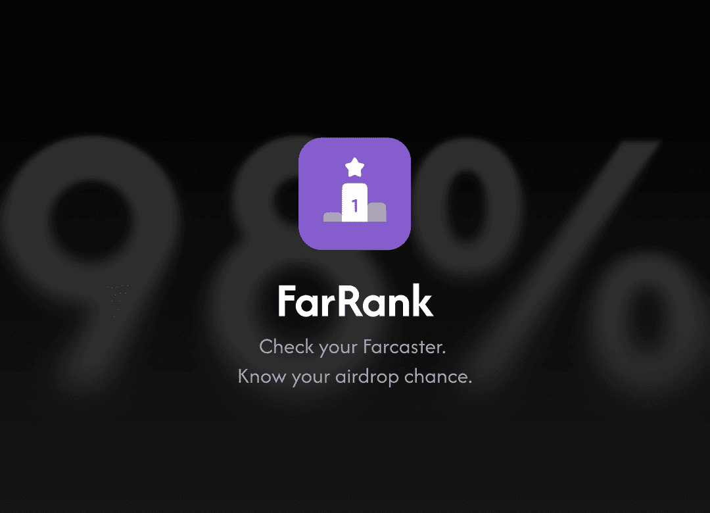
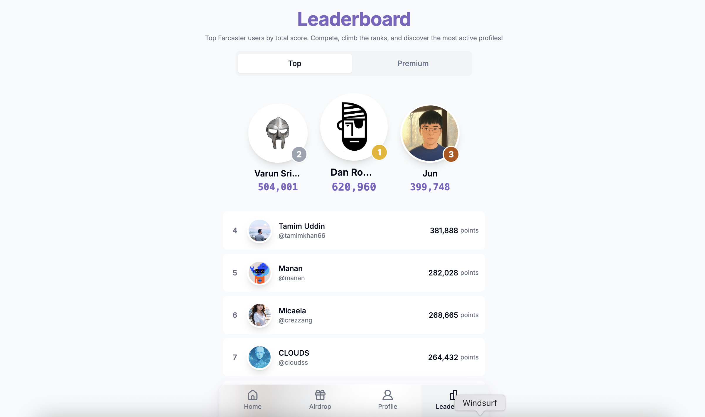
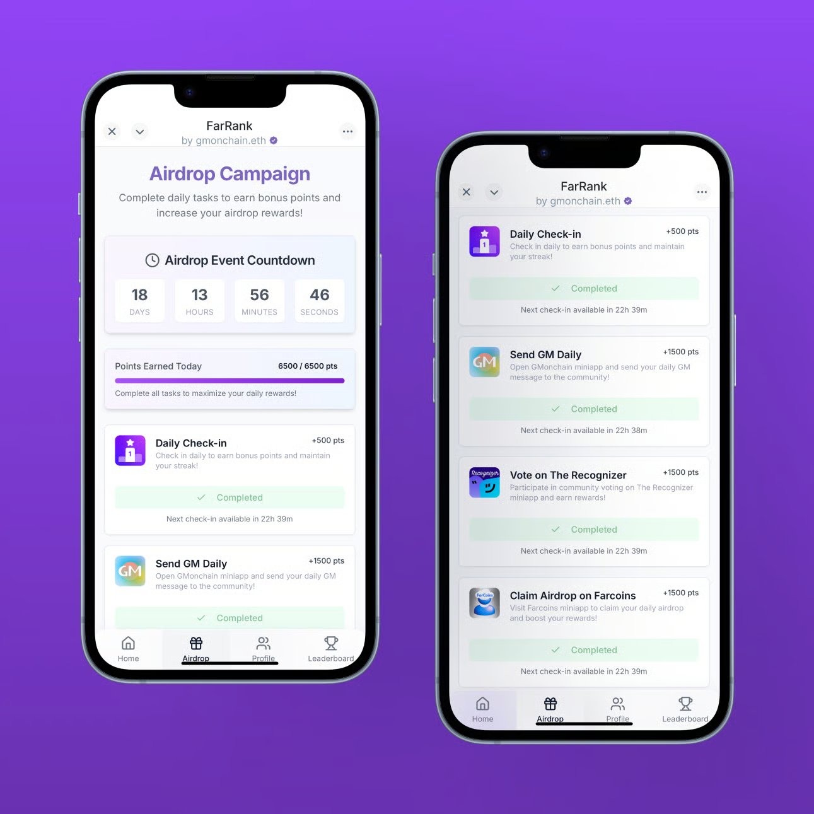

  

## Overview

FarRank addresses the challenges Farcaster users face in the decentralized social landscape. Our platform provides a comprehensive solution for users to establish credibility, track on-chain activities, and maximize participation in airdrops and community events.

## Screenshots
<<<<<<< HEAD

=======

>>>>>>> fe5d00b (Initial commit of project files)

## The Problem FarRank Solves
In an ecosystem where reputation and engagement are everything, Farcaster users often struggle to establish their credibility, track their on-chain activities, and maximize their participation in airdrops and community events.

## Our Solution
FarRank provides a comprehensive solution by offering:

*   **Unified Farcaster Score**: Evaluates user activity to provide a clear measure of their presence and influence.
*   **Detailed Wallet Analytics**: Offers complete financial transparency by tracking on-chain activities.
*   **Real-time Leaderboards**: Allows users to track their standing within the Farcaster community.

Whether you're a casual user verifying airdrop eligibility or a content creator seeking to monetize influence, FarRank simplifies Web3 social interactions. By integrating seamlessly with Farcaster's native features and adding powerful analytics and verification tools, we make it easier to build, track, and grow your presence in the Farcaster ecosystem.

## Farcaster Mini App
Explore FarRank on Farcaster: [https://farcaster.xyz/miniapps/Cd4WmQSF2Xct/farrank](https://farcaster.xyz/miniapps/Cd4WmQSF2Xct/farrank)
